# LLM Stats Interactive Web Scraper - Logical Flow

## 📚 Libraries and Dependencies Used

### System Libraries
- **`<windows.h>`** - Windows API functions
- **`<winhttp.h>`** - WinHTTP API for HTTP/HTTPS requests
- **`winhttp.lib`** - Windows HTTP Services library (linked)

### Standard C++ Libraries
- **`<iostream>`** - Console input/output
- **`<fstream>`** - File input/output operations
- **`<vector>`** - Dynamic arrays for data storage
- **`<string>`** - String manipulation
- **`<iomanip>`** - Output formatting
- **`<algorithm>`** - Sorting and data transformation
- **`<thread>`** - Threading support for delays
- **`<chrono>`** - Time utilities for retry delays

### Third-Party Libraries
- **`json.hpp`** (nlohmann/json) - Modern JSON parsing library for C++

---

## 🔄 Main Program Flow


---

## 🌐 Data Fetching Flow (HTTP Request)


---

## 📊 API Data Processing Flow


---

## 🕷️ HTML Web Scraping Flow


---

## 🗂️ Data Export Structure

```mermaid
flowchart LR
    Source[Parsed Model Data] --> Sorter{Data Sorter}
    
    Sorter --> PerfRank[Performance Ranking<br/>by GPQA Score]
    Sorter --> PriceRank[Price Ranking<br/>by Input Price]
    Sorter --> ValueRank[Value Ranking<br/>by Performance/Price Ratio]
    
    PerfRank --> Export{Export Engine}
    PriceRank --> Export
    ValueRank --> Export
    
    Export --> MD[📄 report.md<br/>Markdown Tables]
    Export --> HTML[🌐 leaderboard.html<br/>Interactive Web Page]
    Export --> CSV1[📊 leaderboard_performance.csv]
    Export --> CSV2[📊 leaderboard_price.csv]
    Export --> CSV3[📊 leaderboard_value.csv]
    Export --> JSON[🔧 leaderboard_all.json<br/>Complete Data Structure]
```



---

## 📋 Data Structures

### ModelEntry Structure
```cpp
struct ModelEntry {
    std::string name;              // Model name (e.g., "GPT-5.2 Pro")
    std::string organization;      // Organization (e.g., "OpenAI")
    double gpqa_score;            // GPQA benchmark score (0.0 - 1.0)
    std::string input_price_str;   // Price string representation
    double input_price_val;        // Parsed numeric price for sorting
}
```

---

## 🔑 Key Functions

### 1. **FetchData(domain, path)**
- **Purpose**: HTTP/HTTPS data fetcher with retry mechanism
- **Returns**: String containing response body
- **Features**: 
  - Retry up to MAX_RETRIES (3) times
  - Progress indicator during download
  - RAII pattern for resource management

### 2. **ParsePrice(priceStr)**
- **Purpose**: Extract numeric value from price strings
- **Returns**: Double value of price
- **Handles**: 
  - "Free" strings → 0.0
  - Invalid formats → 999999.0 (high penalty)
  - Numeric extraction with decimal support

### 3. **FetchAndDisplayModels()**
- **Purpose**: Main API data processing workflow
- **Actions**:
  1. Fetch JSON from API
  2. Parse and store models
  3. Create three rankings
  4. Display to console
  5. Export to 6 file formats
  6. Show statistics

### 4. **ScrapeAndDisplayLeaderboards()**
- **Purpose**: HTML parsing for leaderboard links
- **Method**: 
  - Search for `<a>` tags
  - Filter by href patterns
  - Extract and clean link text
  - Display discovered links

### 5. **ExportToHTML(perfRank, priceRank, valueRank)**
- **Purpose**: Generate interactive HTML report
- **Features**:
  - Tab-based navigation
  - Color-coded rankings
  - Responsive design
  - Dark theme styling

---

## 🎯 Data Scraping Methods

### Method 1: API-Based Scraping
```
Source: api.zeroeval.com/leaderboard/models/full
Method: RESTful API call
Format: JSON response
Data:  - Model names
       - Organization names  
       - GPQA scores
       - Input prices
```

### Method 2: HTML Web Scraping
```
Source: llm-stats.com
Method: HTML parsing
Format: Raw HTML
Data:  - Leaderboard links
       - Page navigation structure
       - Available arena links
```

---

## 🔄 Sorting Algorithms

### Performance Ranking
```
Sort Criteria: GPQA Score (Descending)
Algorithm: std::sort with lambda comparator
Formula: a.gpqa_score > b.gpqa_score
```

### Price Ranking
```
Sort Criteria: Input Price (Ascending)
Algorithm: std::sort with lambda comparator
Formula: a.input_price_val < b.input_price_val
Tie-Breaker: Higher GPQA score wins
```

### Value Ranking
```
Sort Criteria: Performance-to-Price Ratio (Descending)
Algorithm: std::sort with lambda comparator
Formula: (GPQA Score) / (Price + 0.01)
Note: +0.01 prevents division by zero
```

---

## 🎨 Output Formats

| Format | File Name | Purpose |
|--------|-----------|---------|
| **Markdown** | `report.md` | Human-readable summary with tables |
| **HTML** | `leaderboard.html` | Interactive web-based report with tabs |
| **CSV** | `leaderboard_performance.csv` | Performance ranking for Excel/Sheets |
| **CSV** | `leaderboard_price.csv` | Price ranking for Excel/Sheets |
| **CSV** | `leaderboard_value.csv` | Value ranking for Excel/Sheets |
| **JSON** | `leaderboard_all.json` | Complete structured data for APIs |

---

## ⚙️ Configuration Constants

```cpp
const std::wstring API_DOMAIN = L"api.zeroeval.com";
const std::wstring API_PATH = L"/leaderboard/models/full?justCanonicals=true";
const std::wstring WEB_DOMAIN = L"llm-stats.com";
const std::wstring WEB_PATH = L"/";
const int MAX_RETRIES = 3;
const int RETRY_DELAY_MS = 1000;
```

---

## 🛡️ Error Handling

### Network Errors
- Automatic retry mechanism (up to 3 attempts)
- 1-second delay between retries
- Detailed error logging with error codes

### JSON Parsing Errors
- Try-catch blocks for parse errors
- Null value handling for missing fields
- Default values for invalid data

### File I/O Errors
- Check file stream status before writing
- Silent failure with console notification
- RAII pattern ensures file handles are closed

---

## 📈 Program Execution Flow Summary

1. **Initialization** → Display welcome banner and menu
2. **User Selection** → Choose operation from menu
3. **Data Fetching** → HTTP request with retry logic
4. **Data Processing** → Parse JSON/HTML and extract data
5. **Data Ranking** → Sort by performance, price, and value
6. **Display Results** → Show rankings in formatted tables
7. **Export Data** → Generate 6 different output files
8. **Statistics** → Display summary information
9. **Loop Back** → Return to menu for next operation

---

## 🎯 Key Features

✅ **Interactive Menu System** - User-friendly CLI interface  
✅ **Dual Scraping Methods** - API and HTML scraping  
✅ **Retry Mechanism** - Handles network failures gracefully  
✅ **Multi-Format Export** - 6 different output formats  
✅ **Color-Coded Output** - ANSI colors for better readability  
✅ **Progress Indicators** - Real-time download progress  
✅ **RAII Pattern** - Safe resource management  
✅ **Error Handling** - Comprehensive error checking  
✅ **Data Validation** - Price parsing and null handling  

---

*Generated for LLM Stats Interactive Web Scraper v2.0*
